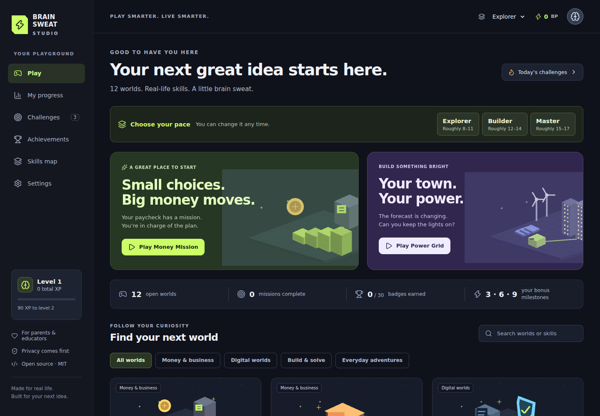

# Brain Sweat Studio

**PLAY SMARTER. LIVE SMARTER.**

A free, MIT-licensed React + TypeScript game and learning studio. **26 original worlds, 22 hands-on classes, eight missions per world, and three difficulty modes.** Version 3 adds advanced math, geometry, calculus, physics, engine and robot builders, an educational virtual computer, modern survival, water and cooking systems, a local production studio, real-time 3D scenes, and a retro cartridge interface. The local assistant, Mentor/Benefactor/Strategist council, optional guided bots, Spanish, profiles, and unfinished-session saves continue across the expansion. No login, ads, analytics, paid API, backend, or public player profiles.

Repository: https://github.com/larrinamsalva/brainsweatstudios

Play the live studio: https://larrinamsalva.github.io/brainsweatstudios/

## Playable worlds

| World | Game loop | Practice |
| --- | --- | --- |
| Money Mission | Allocate a paycheck; handle four weekly surprises | Budgets, needs, saving, borrowing, pretend withholding |
| Side Hustle Simulator | Price services; book customers; run five days; reinvest | Revenue, profit, expenses, time, customer satisfaction |
| Scam Shield | Inspect an inbox; pin warning signs; sort messages | Phishing, impersonation, privacy, independent verification |
| Media Detective | Spend research tokens; pin source cards; file a verdict | Original sources, missing context, evidence, correlation, AI images |
| Fix-It Lab | Inspect; measure; match tools; adjust a simulated model | Measurement, diagnosis, tools, safety, qualified help |
| Code Quest | Build commands; move a robot; debug; use loops and functions | Sequences, conditions, variables, reusable logic |
| Career Forge | Assemble a fictional resume; schedule shifts; interview | Honest examples, hourly pay, availability, workplace communication |
| Food & Fuel | Shop; allocate portions to three days; store groceries | Unit prices, variety, meal planning, labels, food safety |
| Life Admin | Schedule responsibilities; manage daily action slots and bills | Due dates, receipts, warranties, subscriptions, autopay funds |
| Talk It Out | Choose a communication goal; listen; branch through dialogue | Boundaries, respectful disagreement, help, de-escalation |
| Power Grid | Build solar/wind/storage; dispatch six weather turns | Power, energy, storage, demand, efficiency, trade-offs |
| Real World Rescue | Navigate a map; collect resources; make a safe contact plan | Calm decisions, trusted help, weather warnings, private information |
| Music Maker | Compose two bars, perform silently or with sound, and remix | Rhythm, pitch, repetition, rests, variation |
| Frequency Lab | Tune signals; compare waves and octaves; try optional haptics | Hertz, waveform, frequency ratios, timed pulses |
| Botany Garden | Plant containers; observe soil; manage light, weather, and water | Different plant needs, drainage, conservation, observation |
| Math Works | Solve a brief; inspect a live function model | Equations, ratios, systems, quadratic roots, compound growth |
| Geometry Forge | Calculate and compare shapes and solids | Area, volume, Pythagorean theorem, angles, scale |
| Calculus Studio | Solve a limit, derivative, integral, or tangent prediction | Instantaneous change, accumulation, optimization, signed area |
| Physics Lab | Predict quantities and inspect ideal projectile motion | Forces, energy, momentum, springs, braking, pendulums |
| Engine Builder | Assemble components; configure gearing/cooling; run a load test | Torque, RPM, power, efficiency, thermal assumptions |
| Robot Foundry | Assemble hardware; program/step a rover; deliver with a battery reserve | Actuators, sensing, controllers, coordinates, energy budgets |
| Virtual Machine Workshop | Install CPU/RAM/storage/clock; boot and debug instructions | Addressing, arithmetic, bounded loops, separate RAM/disk |
| Modern Trail | Travel six legs; preserve supplies; use community help | Modern transit, weather, rest, resource tradeoffs, resilience |
| Water Works | Build treatment/storage; fix leaks; meet five days of demand | Flow balance, clarity versus safety, alternative sources |
| Kitchen Craft | Plan portions; heat a virtual dish; measure and set cold storage | Heat transfer, food-specific endpoints, storage, waste |
| Creator Studio | Sequence scenes; plan a mix; rehearse; export locally | Rundowns, captions, privacy, moderation, bitrate/frame timing |


Explorer simplifies resources and adds hints. Builder adds constraints. Master tightens resources and decision depth. Suggested ages are approximate, roughly 8–11, 12–14, and 15–17. No birthday is requested.

## Classes and retro lab

Open `#/classes` for two classes in each new learning world. Each includes suggested preparation, an original lesson, worked example, adjustable experiment, three explained knowledge checks, and a link to the live game. Lessons and questions are authored in English and Spanish. Preparation is optional; nothing is locked.

Open `#/lab` to select one of 26 cartridges, or `#/lab/engine` to run a world inside the CRT interface. Green and amber palettes are saved per profile. The actual game host runs inside the console, so checkpoints, bots, earned progress, and classes share the normal studio’s state.

The VM is a bounded educational instruction interpreter, not an OS or arbitrary-code virtualizer. It has no shell, network, or real filesystem access. Engine, robot, survival, and heat values are teaching models with stated assumptions. Water and cooking classes link to CDC and FoodSafety.gov; simulations cannot certify real food or water safety.

Creator Studio previews generated visuals without cameras or microphones. It exports a production-plan JSON and, when the browser supports MediaRecorder/WebM, a silent captioned rehearsal video. It does not stream to an external service. Audio levels are a planning model, and actual video size can differ from the bitrate estimate.

New worlds have native WebGL2 depth, perspective, lighting, and keyboard camera controls, with projected vector fallback. The retro styling uses static scanlines, no flicker. Reduced motion stops animation and repeated drawing; high contrast removes scanlines.

## Run locally

Use Node.js 22.12 or newer (Node 24 recommended).

```sh
npm install
npm run dev
npm run build
npm run test
npm run lint
```

For browser tests:

```sh
npx playwright install --with-deps chromium firefox webkit
npm run test:e2e
BOT_FULL_SWEEP=1 CROSS_BROWSER=1 TEST_PRODUCTION=1 npm run test:e2e
```

If a host cannot expose network interfaces, run `npm run dev -- --host 127.0.0.1`. `PLAYWRIGHT_CHROMIUM_EXECUTABLE_PATH` can point tests to an installed compatible Chromium executable. Use `TEST_BASE_URL` to test another served build.

## GitHub Pages

The production base path is `/brainsweatstudios/`. All application navigation uses hash routes, such as `/#/game/code`, so a refresh asks Pages for the same entry file. Asset URLs use Vite’s production base path.

In the repository’s **Settings → Pages → Build and deployment**, select **GitHub Actions** as the source. The deployment workflow installs the locked packages, runs lint and unit tests, builds the app, and publishes `dist`. It then checks the actual public studio and uploads a screenshot. Pushes to `main` redeploy it. The browser workflow runs on pushes to main and pull requests, and can also be started manually. Game-system changes check all 624 authored bot runs in Chromium, plus accessibility and feature flows in Chromium, Firefox, and WebKit. Assistant-only follow-ups run the interface suite without repeating the unchanged bot simulations.

To fork with another repository name, change the default base in `vite.config.ts` and the workflow’s `VITE_BASE_PATH`, or set that variable for the build. Set `LIVE_SITE_URL` on the published-studio verification step to the fork’s URL. For a root-domain deployment, use `VITE_BASE_PATH=/ npm run build`.

An original service worker precaches the application and all game chunks after the first successful production visit. After installation finishes, the worlds can run offline. It caches only public application assets; progress stays in local storage. Online reloads request the current page instead of permanently serving an older cached page. Updated workers activate without waiting for every old tab to close and retain the previous build’s assets while those tabs await a refresh. A **Refresh studio** notice lets players choose when to load an update; unfinished checkpoints remain saved. If a tab is still running the original release, close every Brain Sweat tab and reopen the studio once. Use a web server to preview `dist`; opening `index.html` directly from a filesystem is unsupported.

Before publishing, the workflow rebuilds the original v1 and the pre-fix v2, reproduces the stale-page problem, and tests upgrading with two old tabs open. It checks earned progress, old lazy assets, the update notice in English and Spanish, checkpoint refresh, and continued offline play.

## Progress and privacy

- Six anonymous local profiles are stored in `brain-sweat-studio:profiles:v2`. Each has its own settings, rewards, and mission checkpoints. The active save is also mirrored under the legacy `brain-sweat-studio:v1` key. Existing version 1 and 2 saves migrate automatically. The schema remains version 2 with optional migrated class records and retro palette.
- Class experiments and answer checks save per profile, export with backups, and do not grant game XP. A class is marked mastered only after all three answers are correct.
- Finished results store scores, attempts, completion, XP, Brain Points, badges, settings, and local dates.
- Score 60 completes a mission; score 90 earns three mastery stars. Eight missions × three modes × twenty-six worlds = 624 distinct completion slots.
- Replay XP is only the increase in a mission’s best score. The 3, 6, and 9 completion milestones each award a one-time bonus.
- Fifty-eight achievement badges use actual mission and level conditions. All games are available from the start.
- Challenges rotate deterministically using the device’s local date. Missing a day never removes progress.
- Settings includes JSON export, validated import, and a confirmation before reset. Import derives XP and badges from mission records and rejects malformed data before replacement.
- Mission controls save checkpoints during play, including programs, budgets, evidence, dialogue, music, and gardens. Reopen a world or use Continue your adventure to resume. A running robot resumes stopped. Export includes unfinished checkpoints; reset affects only the active profile.
- No personal information, tracking, advertising, location, credentials, or real employment details are requested. All scenarios are fictional.

The host receives the ordinary technical requests needed to deliver a website. The app does not send game saves to a server. Browser data deletion can erase a save; keep an exported backup. People sharing one browser can choose separate local slots. Clearing browser data erases those slots.

## Architecture

```text
src/app/          Studio pages and lazy game host
src/components/  Accessible icons, dialogs, error boundary
src/engine/      Original geometric scene builder and native WebGL2 renderer
src/games/       Twenty-six game loops and authored field missions
src/data/        Typed game manifest, difficulty and result interfaces
src/systems/     Profiles, checkpoints, local council, bots, XP, procedural audio
src/i18n/        Reviewed Spanish catalog and JSX localization
src/styles/      Design tokens, responsive layouts, focus and contrast
tests/           Unit and browser gameplay tests
scripts/         Offline packaging, dependency notices, screenshots
.github/         Build, verification, and Pages workflows
```

Game controls and relevant visual state have DOM equivalents. WebGL2 draws each active game world. If WebGL2 is unsupported or lost, original vector graphics and all game controls remain available. The renderer caps resolution and frame rate, stops animation when hidden or paused, and deletes its GPU resources when leaving a game. Games load in separate chunks. No external fonts, images, or sound assets are downloaded.

## Add another game

1. Create `src/games/MyGame.tsx` with a default component accepting `GameProps` from `src/data/types.ts`.
2. Implement a real game loop using `difficulty`, `mission`, and `paused`. Call `onFinish({ score, summary, lesson, metrics })` once at the end. Keep the score between 0 and 100.
3. Use `useMissionState` for persistent controls and register each field’s schema in `checkpointValidation.ts`. Add a bot strategy and checkpoint roundtrip coverage.
4. Add the game’s ID to `GameId`, register its manifest and lazy import in `src/data/games.ts`, and add the tutorial in `src/app/GameHost.tsx`.
5. Add its original world geometry to `src/engine/geometry.ts` or reuse an appropriate scene. Keep keyboard and touch equivalents for actions.
6. Add any new achievement conditions in `src/systems/progress.ts` and update save-validation limits if adding distinct mission records.
7. Add meaningful gameplay tests and run lint, tests, and the production build.

See [CONTRIBUTING.md](CONTRIBUTING.md), [SECURITY.md](SECURITY.md), and [CODE_OF_CONDUCT.md](CODE_OF_CONDUCT.md).

## Licensing

Original code, geometry, and procedural sound: [MIT](LICENSE). Package versions, licenses, and runtime license texts are listed in [THIRD_PARTY_NOTICES.md](THIRD_PARTY_NOTICES.md). Run `npm run licenses` after dependency changes. No copyrighted characters, unlicensed assets, real passwords, or external paid services are included.

## Screenshots




## Version 2 additions

- Agent playtesting and optional visible bot control replace the planned human playtest phase. Bots press the actual mission controls, can pause or yield to the player, and never earn XP, badges, or streaks. They use deterministic authored strategies, with an action limit and clear stop messages.
- Missions 6–8 in each original world add a connected field scenario after the base simulation. Three decisions spend resources and time, change trust, and affect the final result. The three creative worlds each have eight authored briefs.
- The personal assistant matches a learning topic and saved progress to an unfinished mission. Its Mentor explains, Benefactor suggests available support, and Strategist proposes steps. It runs locally with authored guidance; it does not call a cloud language model or provide actual funding.
- English and Spanish cover the interface, mission stories, advice, controls, and results. Search recognizes translated world titles and skills. The toolbar can read the page with a matching on-device voice. No microphone or remote voice is used; devices without that voice keep the text.
- Music uses original procedural tones. Frequency and waveform tasks also work silently. Haptics are optional timed on/off pulses on supported devices. Garden moisture, growth, money, and weather are fictional model units; the soundtrack does not affect plant growth.
- Accessibility checks include automated WCAG scans, keyboard and touch paths, narrow displays, reduced motion, simulated slower CPU/high-density displays, and vector fallback. See [the verification record](docs/verification.md) for actual coverage and limits.


