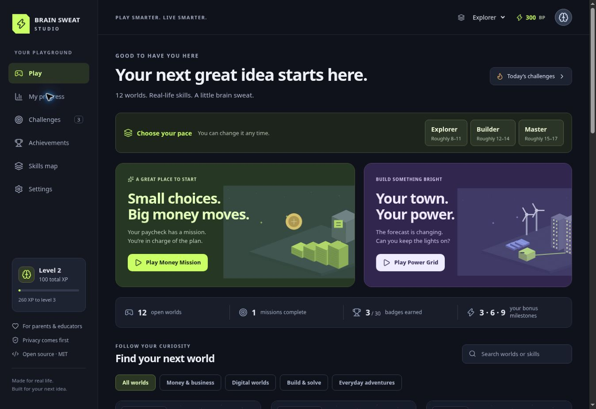
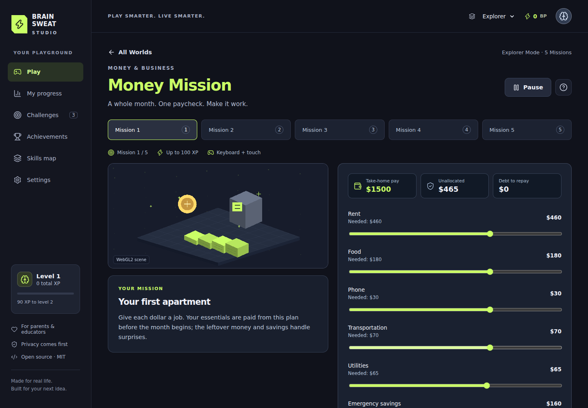
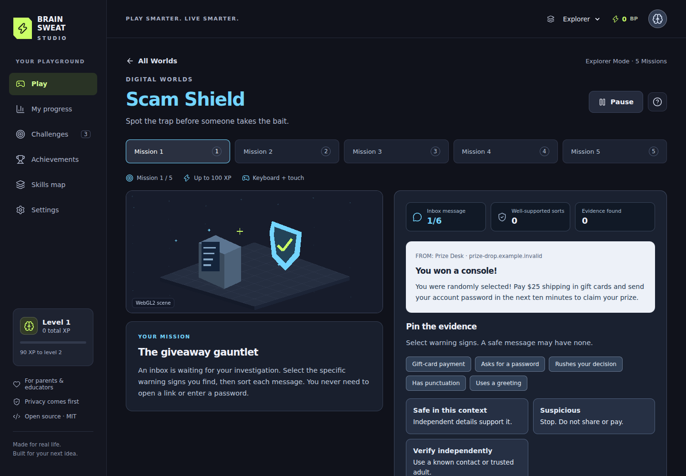
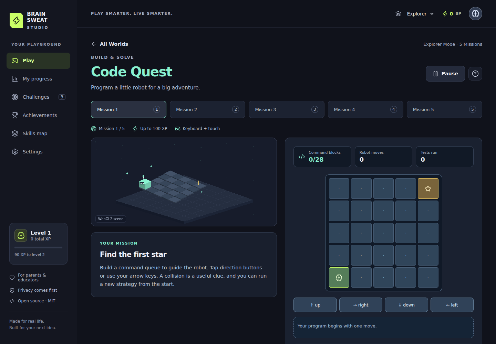
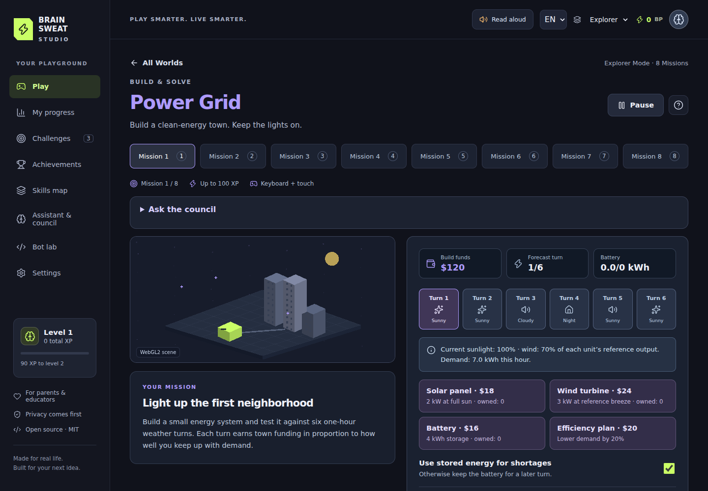
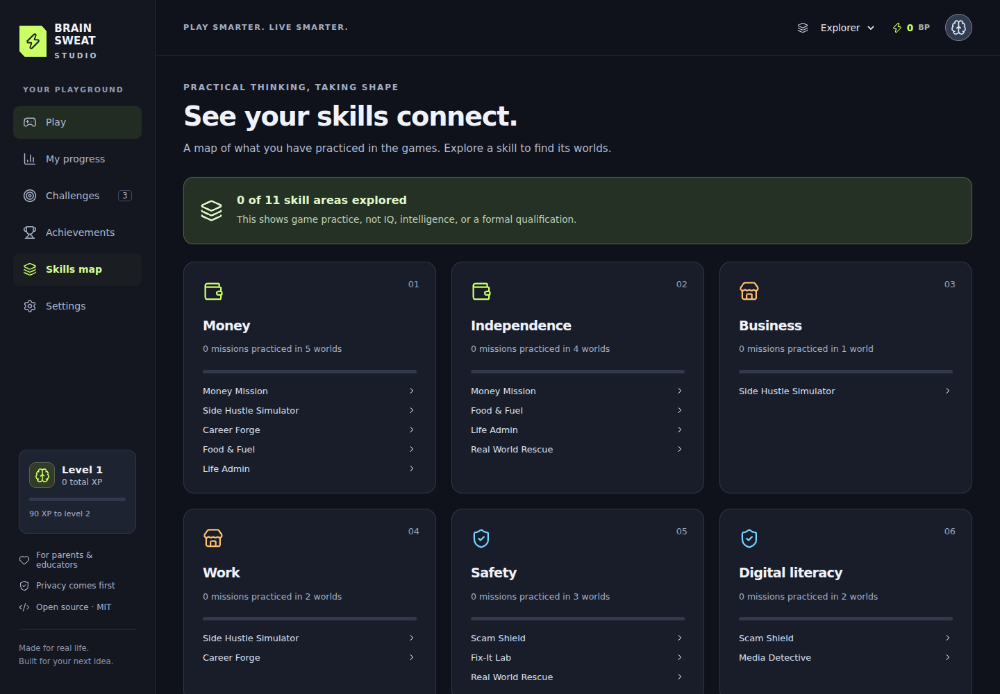

# Brain Sweat Studio

**PLAY SMARTER. LIVE SMARTER.**

A free, MIT-licensed React + TypeScript game studio about practical thinking and independence. Twelve original game worlds, five missions in each world, and three difficulty modes. No login, ads, analytics, paid API, backend, or public player profiles.

Repository: https://github.com/larrinamsalva/brainsweatstudios

Play the live studio: https://larrinamsalva.github.io/brainsweatstudios/

## Playable worlds

| World | Game loop | Practice |
| --- | --- | --- |
| Money Mission | Allocate a paycheck; handle four weekly surprises | Budgets, needs, saving, borrowing, pretend withholding |
| Side Hustle Simulator | Price services; book customers; run five days; reinvest | Revenue, profit, expenses, time, customer satisfaction |
| Scam Shield | Inspect an inbox; pin warning signs; sort messages | Phishing, impersonation, privacy, independent verification |
| Media Detective | Spend research tokens; pin source cards; file a verdict | Original sources, missing context, evidence, correlation, AI images |
| Fix-It Lab | Inspect; measure; match tools; adjust a simulated model | Measurement, diagnosis, tools, safety, qualified help |
| Code Quest | Build commands; move a robot; debug; use loops and functions | Sequences, conditions, variables, reusable logic |
| Career Forge | Assemble a fictional resume; schedule shifts; interview | Honest examples, hourly pay, availability, workplace communication |
| Food & Fuel | Shop; allocate portions to three days; store groceries | Unit prices, variety, meal planning, labels, food safety |
| Life Admin | Schedule responsibilities; manage daily action slots and bills | Due dates, receipts, warranties, subscriptions, autopay funds |
| Talk It Out | Choose a communication goal; listen; branch through dialogue | Boundaries, respectful disagreement, help, de-escalation |
| Power Grid | Build solar/wind/storage; dispatch six weather turns | Power, energy, storage, demand, efficiency, trade-offs |
| Real World Rescue | Navigate a map; collect resources; make a safe contact plan | Calm decisions, trusted help, weather warnings, private information |

Explorer simplifies resources and adds hints. Builder adds constraints. Master tightens resources and decision depth. Suggested ages are approximate, roughly 8–11, 12–14, and 15–17. No birthday is requested.

## Run locally

Use Node.js 22.12 or newer (Node 24 recommended).

```sh
npm install
npm run dev
npm run build
npm run test
npm run lint
```

For browser tests:

```sh
npx playwright install chromium
npm run test:e2e
```

If a host cannot expose network interfaces, run `npm run dev -- --host 127.0.0.1`. `PLAYWRIGHT_CHROMIUM_EXECUTABLE_PATH` can point tests to an installed compatible Chromium executable. Use `TEST_BASE_URL` to test another served build.

## GitHub Pages

The production base path is `/brainsweatstudios/`. All application navigation uses hash routes, such as `/#/game/code`, so a refresh asks Pages for the same entry file. Asset URLs use Vite’s production base path.

In the repository’s **Settings → Pages → Build and deployment**, select **GitHub Actions** as the source. The deployment workflow installs the locked packages, runs lint and unit tests, builds the app, and publishes `dist`. Pushes to `main` redeploy it. The browser workflow runs on pull requests and can also be started manually.

To fork with another repository name, change the default base in `vite.config.ts` and the workflow’s `VITE_BASE_PATH`, or set that variable for the build. For a root-domain deployment, use `VITE_BASE_PATH=/ npm run build`.

An original service worker precaches the application and all game chunks after the first successful production visit. After installation finishes, the worlds can run offline. It caches only public application assets; progress stays in local storage. A new service worker activates after old controlled tabs close. Use a web server to preview `dist`; opening `index.html` directly from a filesystem is unsupported.

## Progress and privacy

- Device-local versioned save: `brain-sweat-studio:v1`.
- Finished results store scores, attempts, completion, XP, Brain Points, badges, settings, and local dates.
- Score 60 completes a mission; score 90 earns three mastery stars. Five missions × three modes × twelve worlds = 180 distinct completions.
- Replay XP is only the increase in a mission’s best score. The 3, 6, and 9 completion milestones each award a one-time bonus.
- Thirty achievement badges use actual mission and level conditions. All games are available from the start.
- Challenges rotate deterministically using the device’s local date. Missing a day never removes progress.
- Settings includes JSON export, validated import, and a confirmation before reset. Import derives XP and badges from mission records and rejects malformed data before replacement.
- Unfinished sessions are not saved mid-mission. Stop between missions or use Pause while keeping the tab open.
- No personal information, tracking, advertising, location, credentials, or real employment details are requested. All scenarios are fictional.

The host receives the ordinary technical requests needed to deliver a website. The app does not send game saves to a server. Browser data deletion can erase a save; keep an exported backup. Shared browser profiles share a save.

## Architecture

```text
src/app/          Studio pages and lazy game host
src/components/  Accessible icons, dialogs, error boundary
src/engine/      Original geometric scene builder and native WebGL2 renderer
src/games/       Twelve independent game loops and common controls
src/data/        Typed game manifest, difficulty and result interfaces
src/systems/     Local saves, XP, achievements, challenges, procedural audio
src/styles/      Design tokens, responsive layouts, focus and contrast
tests/           Unit and browser gameplay tests
scripts/         Offline packaging, dependency notices, screenshots
.github/         Build, verification, and Pages workflows
```

Game controls and relevant visual state have DOM equivalents. WebGL2 draws each active game world. If WebGL2 is unsupported or lost, original vector graphics and all game controls remain available. The renderer caps resolution and frame rate, stops animation when hidden or paused, and deletes its GPU resources when leaving a game. Games load in separate chunks. No external fonts, images, or sound assets are downloaded.

## Add another game

1. Create `src/games/MyGame.tsx` with a default component accepting `GameProps` from `src/data/types.ts`.
2. Implement a real game loop using `difficulty`, `mission`, and `paused`. Call `onFinish({ score, summary, lesson, metrics })` once at the end. Keep the score between 0 and 100.
3. Add the game’s ID to `GameId`, register its manifest and lazy import in `src/data/games.ts`, and add the tutorial in `src/app/GameHost.tsx`.
4. Add its original world geometry to `src/engine/geometry.ts` or reuse an appropriate scene. Keep keyboard and touch equivalents for actions.
5. Add any new achievement conditions in `src/systems/progress.ts` and update save-validation limits if adding distinct mission records.
6. Add meaningful gameplay tests and run lint, tests, and the production build.

See [CONTRIBUTING.md](CONTRIBUTING.md), [SECURITY.md](SECURITY.md), and [CODE_OF_CONDUCT.md](CODE_OF_CONDUCT.md).

## Licensing

Original code, geometry, and procedural sound: [MIT](LICENSE). Package versions, licenses, and runtime license texts are listed in [THIRD_PARTY_NOTICES.md](THIRD_PARTY_NOTICES.md). Run `npm run licenses` after dependency changes. No copyrighted characters, unlicensed assets, real passwords, or external paid services are included.

## Screenshots








## Next five improvements

1. Playtest with kids, teens, and adults to tune vocabulary, challenge, and session length.
2. Expand each world with richer missions, longer consequences, and more alternate strategies.
3. Add Spanish translations and optional on-device reading support.
4. Broaden accessibility tests across screen readers, browsers, and low-power devices.
5. Add optional in-progress mission checkpoints and multiple anonymous device-local save slots.
