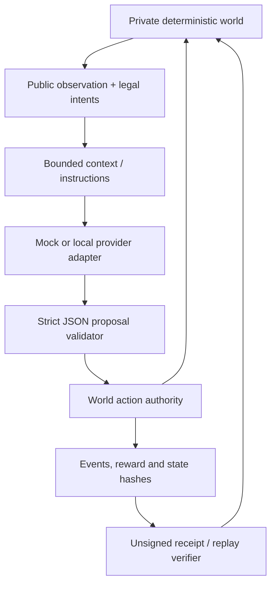

# V7 model controllers

Open `#/academy?tab=garage`. The Garage is an advanced experiment surface;
ordinary games, rewards and classes retain their existing behavior. Select the
offline mock, start a world, step or run, inspect a proposal and verify replay.
Ollama is an optional local transport, not a requirement or built-in model.

`src/runtime/garageWorlds.ts` is provider-free. It delegates sports, outpost,
scenario, space and rover to unchanged V6 runtime/environment 1.0.0. It also
implements Survey, Community Restore and Signal Maze at version 1.0.0.
`src/agents/` owns instructions, schemas, context, adapters, orchestration,
receipts, manifests and bounded local saving. React owns controls and presentation.
The optional Node bridge is not included in the website or online server bundle.

## Controllers and registry

`agent-controller@1` contains exactly schema, id, family, provider,
adapterVersion, model, settings and package. Families: model, human, reference,
rules and q-learning. Providers: none, mock, ollama. Settings record temperature,
seed, schema/json output mode and mock behavior; package is null except for
validated frozen V6 rule/Q packages. Adapter version is 1.0.0. Unknown fields,
secrets, scripts, unsupported versions and incompatible packages fail import.

The provider registry is independent of world ids. A future provider extends
its typed descriptor and registry factory without modifying world transitions.
No cloud adapter, cloud key, tool execution or arbitrary callback import exists.
The world never receives a provider SDK or lets a controller mutate state.

The reference policy uses the same public observation as models. It applies
V6 authored rules, BFS routing for the public rover map, scan/search/deliver
for Survey, causal district dependencies for Community, and the mission route
for Signal Maze. It is a known authored policy, not a learned language model.
The Garage can compare a model with a reference, saved champion or frozen Q-table
where compatible. Actual rule search and Q updates remain in their V6 tools.

## Async lifecycle

IDLE → OBSERVING → REQUESTING → RECEIVED → VALIDATING → ACTING → WAITING.
Human controllers wait for explicit legal input. PAUSED cancels an in-flight
request and retains the live world. Resume continues that world. Stop cancels
work and records a stopped partial episode. COMPLETE covers world termination
or a budget stop. ERROR records failed proposals without advancing the world.

Each request has an episode id, actor, tick and increasing sequence. Generation
checks discard late responses after pause, stop, disconnect, handoff or a changed
actor/tick. Abort and a deadline bound waiting even when a provider ignores its
signal. Retries are at most two; fatal version/stale/disconnect/cancel/budget
errors do not retry. Error codes distinguish illegal, malformed, oversized,
empty, refusal, timeout, unavailable, incompatible, stale and disconnected data.
Raw provider error bodies are never stored or shown.

Manual takeover and human → reference → model → human handoffs keep the same
world. The receipt records actor, tick, record boundary, old/new descriptors and
short operator reason. Community has exactly engineer/logistics actors and
ordered turns. Each gets its own role, mask, history and notebook. Two models,
model/reference or model/human are possible; an actor cannot impersonate another.

## Context and notebook

- STATE_ONLY: current public observation.
- RECENT_WINDOW: at most six own executed actions and bounded events.
- EVENT_SUMMARY: at most twelve deterministic event counters.
- BOUNDED_EPISODE_MEMORY: counters and a public `agent-notebook@1`.

Notebook fields are facts, plans, warnings, completed and unresolved: at most
eight strings of 160 characters each, additionally limited by bytes. Host summaries
come from actual world events; optional model notes remain untrusted annotations.
No private reasoning, chain-of-thought, weights or conversation transcript is
requested or persisted. The inspector labels a short supplied note honestly.

## Frozen experiments and limits

`model-experiment@1` freezes environment/options, curriculum, controller bindings,
baseline, context, instructions/schema versions, budgets and split recipes.
One to four seeds per group are used (UI default two), in this order: TRAIN,
VALIDATION, ordinary HOLDOUT, changed HOLDOUT. Candidate and baseline use the same
world configuration and seeds. V6's eight-seed disjoint recipes are retained;
TRAIN here is practice with no model weight or automatic prompt update.

Reports show completion, score, ticks, reserves, invalid output, timeouts,
retries, blocked attempts, failure reasons and transfer delta in percentage
points. Recovery counts rejected-then-valid decisions and an immediately
following objective event after a blocked/precondition event; they are narrow
observations, not general recovery competence. Mock probes deliberately inject
bounded early blocked/task/resource actions before a known policy resumes.
Repeated manual tuning against HOLDOUT contaminates that final interpretation.

Default per episode: 120 ticks, 160 requests, 10-second timeout, one retry,
16 KB observation, 4 KB response, 2 KB notebook. Absolute ranges are enforced
in `validateBudgets`. Comparison default total is 2,000 controller requests,
maximum 6,000. No unbounded retries, context, trace or history. Pause/resume also
works during comparisons; stopping keeps completed episode evidence. Monetary
cost is UNKNOWN; tokens appear only when reported by the provider.

`npm run test:agents` needs no external AI. `npm run qualify:ollama` is optional;
without `--model EXACT_INSTALLED_MODEL` it only checks availability/lists models.
No selected model is hardcoded or downloaded. Real-model availability and bounded
results must not be confused with deterministic mock/transport coverage.
