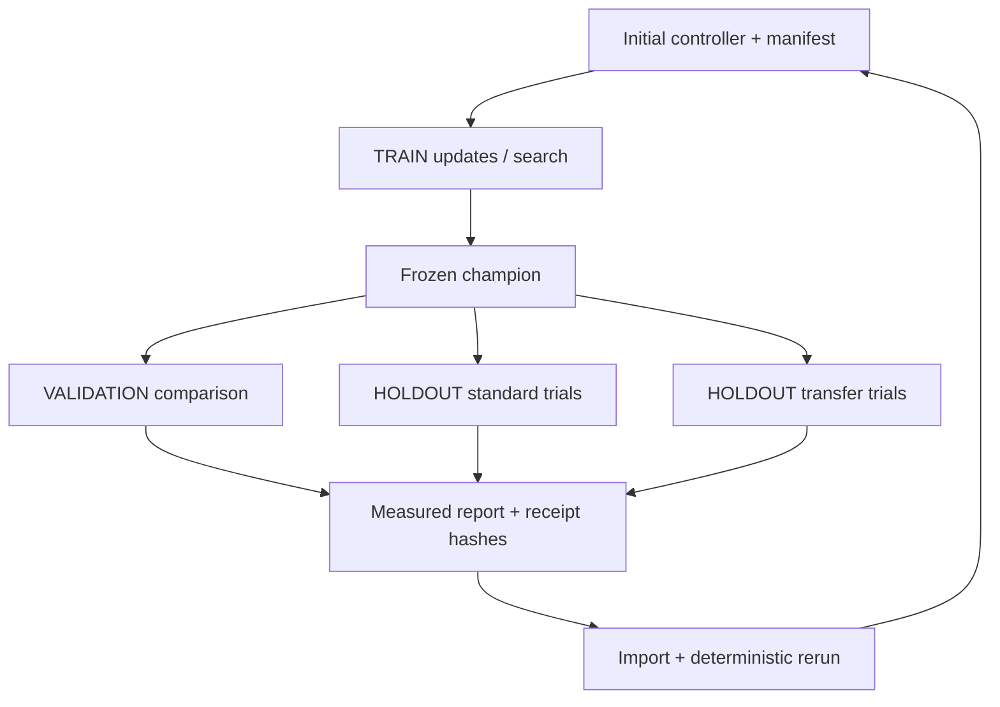

# Agent runtime specification — runtime 1.0.0

Application V6 introduces **runtime 1.0.0** and **environment 1.0.0** for the
five bounded simulation families. These numbers are distinct from application
semver and local save version 2. There is no AI provider dependency, networking
requirement, arbitrary-code loader, or model key in this package.

## Environment and controller contracts

`createEnvironment(config)` returns the small synchronous API in
`src/runtime/types.ts`. Config has exactly `environment`, `version`, `seed`,
`difficulty`, `variant`, `mode`: five supported ids, seed 0–999999, difficulty
0–2, standard/constraints/transfer, and courier/storm (storm only for rover).
Episode ids are deterministic hashes of config and controller metadata.

| Operation | Contract |
|---|---|
| `reset(seed?)` | Rebuild initial authoritative state and return frozen observation |
| `observe()` | Frozen detached public state, objective, condition sensors, rover index and map; no mutable reference or rover RNG stream |
| `availableActions()` | Ten arena intents or four rover directions with enabled flags and descriptions |
| `step(unknown)` | Validate one intent, apply one canonical transition, return observation/events/reward/result |
| `snapshot()` | Detached serializable `snapshot@1` with matching config and state; history excluded |
| `restore(unknown)` | Host-only operation; strict shape/numeric/config checks, atomic assignment after validation |
| `stateHash()` | SHA-256 of canonical config + authoritative state, excluding controller commentary/presentation/history |
| `isTerminal()`, `result()` | Goal, tick-limit or resource-exhausted; ticks, score, accumulated reward and collisions |

Blocked movement remains a legal attempt that consumes a tick and may penalize
the controller. Interact is a legal attempt whose objective preconditions may
not be satisfied. The mask is an intent boundary, not an oracle about which
action will succeed. At termination every action is disabled; invalid input
throws without advancing the world. Snapshots are a trusted-host continuation
mechanism, not a certificate that an arbitrary imported state was reachable.
Receipts always replay from the configured initial state instead of trusting a
supplied terminal snapshot.

Controllers expose `reset`, `metadata`, `chooseAction(observation, mask)`.
Metadata includes family/version/policy hash. A decision has an action and may
include a reason, rule index or four Q-values. The runtime does not invent a
reason if the controller supplies none. Human adapters consume one queued
intent; authored and rule adapters use first matching condition; replay adapters
consume recorded **intents**; the frozen Q adapter uses a deterministic argmax.
The Q **learner** is separate: it updates a private table using TRAIN rewards,
alpha .25, gamma .97 and zero terminal bootstrap. Its environment step is the
same validated boundary. Bounded rule search evaluates a finite neighborhood
with the same runner; it is not model fine-tuning.

## Determinism and seeds

Canonical JSON sorts object keys and rejects nonfinite/unserializable data.
The dependency-free synchronous SHA-256 implementation is checked against
Node crypto, including UTF-8 and multiblock inputs. Hashes identify records and
detect changes; they are not signatures, anti-cheat certificates or proofs of
controller provenance. The server never accepts local scores/hashes as results.

Environment, search/experiment, learner exploration and presentation seeds are
separate. Rover environment RNG is stored in its private snapshot, while the
learner uses its own recorded PRNG seed. Rendering uses independent time and
procedural decoration. Tests change `Math.random` and prove results unchanged.
Same runtime/environment version, configuration, initial state and controller
produce the same transitions, results and hashes.

Behavior-breaking changes require bumping the relevant environment/runtime
version and updating compatible packages/goldens. Imported old metadata is
retained in files; unsupported versions fail honestly. No silent version
rewriting or coordinate-only verification is allowed.

## Receipt schema

`episode@1` has exactly:

| Field | Meaning |
|---|---|
| `schema`, `runtime`, `episodeId` | Format/runtime identity and deterministic local episode id |
| `config`, `controller` | Full environment options and controller family/version/hash |
| `initialHash` | Configured initial authoritative state |
| `steps` | Ordered tick, pre-action observation/mask, decision, authoritative transition, changed fields, state hash |
| `result`, `finalHash` | Terminal outcome and final authoritative state |
| `digest` | SHA-256 of all preceding fields |

Transitions include intended and executed action, reward, events, next
observation and result. Wind therefore cannot be confused with the selected
rover action. Arena step reward is change in model score; rover reward retains
its movement/collision/pickup/delivery/timeout shaping.

`verifyReceipt` bounds 1–120 rows, checks versions/identity/digest, resets the
environment, compares every observation and mask, reruns every action and
checks events/rewards/changes/state hashes plus the terminal result. It rejects
extra fields, post-terminal actions, truncated episodes and tampering even if
the digest was recomputed. It verifies **environment execution**; an unsigned
controller hash/reason alone cannot authenticate who authored a controller or
prove that it generated the action. `inspectTick` reads immutable verified
transitions; stepping backward never changes the original run.

## Controller package schema

`controller@1`: `schema`, `runtime`, `controller`, `compatible`, `parameters`,
`digest`. This implementation supports one exact compatible environment/version
per package. Rules/authored packages contain 1–8 exact condition/action pairs.
Q packages contain exactly 294×4 finite values in −100…100, mode and bounded
training episode count. Unknown fields, impossible actions, dimensions, numeric
values, version mismatches and policy/digest mismatches fail. Imports are
data-only. Legacy `{version:1, kind, rules}` maps to a current rule package while
retaining the legacy export needed by older competition clients.

## Experiments, curricula and transfer

`experiment@1` records runtime/environment version, deterministic id, curriculum,
experiment seed, explicit three seed sets, **initial** controller package,
method, bounded parameters, optional measured result, 32 receipt hashes and
integrity digest. The initial package is retained so training can be reproduced,
not accidentally repeated from its final champion. Methods: frozen comparison,
1–8 search generations, or 1–1000 new Q episodes. Parameters record fixed alpha,
gamma, exploration PRNG seed and episode limit.

For experiment seed 0–99, each split has eight seeds:

| Split | Recipe | Permitted use |
|---|---|---|
| TRAIN | `1000 + seed*101 + i*17` | Learning updates and search selection |
| VALIDATION | `40000 + seed*101 + i*17` | Frozen comparison; manual curriculum choice may use it |
| HOLDOUT | `20000 + seed*101 + i*17` | Frozen final report; not used by training/search |

The manifest validator requires this disjoint recipe. Classic rover training
retains its separate 0–9999 seeds and classic evaluation its 20000+ series;
neither can overlap validation. Experiment Q training uses only its TRAIN set.
There is no automatic selection against holdout or transfer results. Repeated
human tuning against a holdout report contaminates that interpretation; choose
a fresh experiment before reporting a final comparison.

Six inspectable stages reuse Explorer/Builder/Master, then limited reserves,
unfamiliar conditions and constrained transfer. Unfamiliar/transfer stages are
not new difficulty rankings; their data specifies training variant and the
changed evaluation conditions. Transfer variants shift sport barriers/energy,
survival supplies/water, scenario site order, space positions/velocity/fuel,
and rover barriers/parcel site/wind. Causal objective rules remain documented.
The compressed 294-row Q learner aliases unfamiliar layouts; this limitation
is visible in transfer failures. Reports distinguish TRAIN, VALIDATION,
in-distribution HOLDOUT and changed HOLDOUT, with success delta in percentage
points and terminal failure counts. These measure bounded transfer, not
general intelligence or real-world competence.

`experimentSteps` yields bounded work for the UI. `runExperiment` consumes it
headlessly. `verifyExperiment` reruns the initial manifest and compares measured
results and every receipt digest. `npm run test:headless -- 1000` bundles and
runs the DOM-free harness, reporting reproducibility and observed throughput.

## Multi-agent and future adapters

The minimal generic multi-agent contract has agent ids, separate observations
and masks, shared authoritative state and ordered turns. `createDispatchTeam`
exercises it locally with 2–4 agents, three ordered observe/protect/dispatch
tasks and a 30-tick cap. The same `dispatchStep` transition drives the existing
online cooperative room under server membership/turn/CAS checks. It is a
substrate, not a new online game or simultaneous-turn engine. Agent Duel uses
independent shared-seed arena runs through this runtime on the server.

`AsyncController` documents a future local/remote model boundary. A host can send
only a detached observation/mask, await a data-only decision with an AbortSignal,
discard a stale episode/tick response, then call the same validator/step. A model
must never receive environment mutation methods or storage/online credentials.
No such provider is connected in V6; adapter cancellation, latency budgets,
consent and explicit upload controls require a separate reviewed integration.

## V7 extension

The previously future async model host is now implemented independently in
`src/agents/`, using unchanged V6 world rules through `garageWorlds.ts`. See
[model controllers](agent-controllers.md), [observations](model-observations.md)
and [new artifacts](model-actions.md). V6 receipt/package/manifest validators
remain intact; their unsigned provenance limitations still apply. Optional
model output cannot mutate world state or confer server competition authority.
