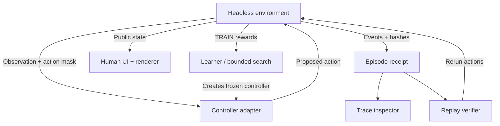
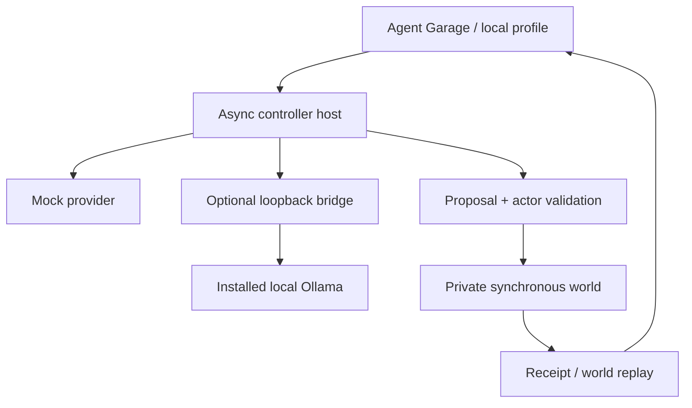
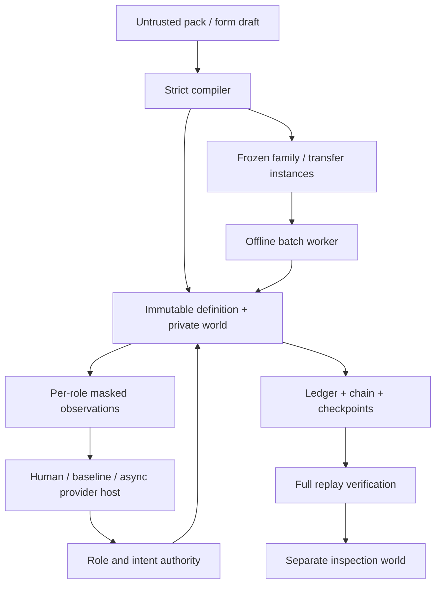

# Brain Sweat architecture

Brain Sweat remains a human educational studio. The 37 ordinary worlds, classes,
assistant/council, checkpoints, progress, retro lab, sound and offline shell are
preserved. Advanced instrumentation lives in the Agent Academy.

## Ownership

| Layer | Responsibility |
|---|---|
| `src/runtime/arenaRules.ts`, `roverRules.ts` | Canonical deterministic physics/resources/objectives; V5 default behavior retained |
| `environment.ts`, `types.ts` | Private authoritative state; versioned config, reset/observe/mask/step/snapshot/restore/hash/result |
| `controllers.ts` | Human, authored, rule, replay and frozen-Q decisions; observations only |
| `receipts.ts` | Bounded full receipts, environment replay verification, immutable tick inspection, fast headless runs |
| `packages.ts`, `experiments.ts`, `curriculum.ts` | Strict data-only packages, reproducible training/evaluation manifests and transfer definitions |
| `multiAgent.ts` | Shared ordered-turn dispatch transition, per-agent observations/actions and local team substrate |
| `src/training/models.ts` | Bounded neighborhood search, actual tabular Q updates, legacy Academy validation |
| `src/app/RuntimeLab.tsx` | Approachable experiment controls, split/transfer reports, inspection, local file exchange |
| `legacy.ts` | Existing arena React checkpoints and visual traces adapted to the authority boundary |
| `src/online/server.ts` | Server-selected seeds, independent policy execution and CAS-authorized online state |
| Renderer/audio | Read state; presentation timing/randomness cannot change a simulation |

Only sports, outpost, scenario, space and the Academy rover migrate in this rung.
The remaining worlds keep their verified game loops. Mission checkpoints retain
their shapes; arena transitions now pass through a validated human/policy
adapter. Search uses the headless runner directly. The Q learner updates its own
table from environment transitions, while evaluation uses frozen greedy values.
No controller receives `step`, `restore`, a mutable state reference, or a server
credential. Host code owns those operations.

## Data and performance

Profile schema stays at version 2. Missing Academy data migrates to a fresh
Academy; existing V5 `controllers`/`rover` data gains an empty experiment
notebook. Version 1 policy files remain supported in the lab, arenas and online
policy editor. New artifacts have independent schema/runtime/environment
versions. See [runtime contracts](agent-runtime.md).

The notebook retains three manifests, one verified receipt and one controller
package per local profile. It is limited to 600 KB; the original V6 Academy import cap was 900 KB. Current V8 Academy/progress
file caps are 3 MB, while each individual notebook retains its own bound. Rule and rover histories stay at 80 points, arena traces at 120 ticks,
rover traces at 80. No unlimited episode history or cloud archive is added.

Initial profiling found repeated route/observation construction made the full
12-curriculum search regression take about 72 seconds locally. Headless
assessment now avoids legacy visual traces, observations are immutable and
cached until the next step, and deterministic route answers have a bounded
4,096-entry cache. The same regression takes about 8–10 seconds locally; its
individual test budget is 20 seconds, with every original assertion retained.
A 1,000-episode sweep executes roughly 77,000 duplicate-checked transitions in
about 1.5–1.6 seconds on this workspace, including a 1,000-episode learner setup
and 15 verified receipts. These are machine-specific measurements, not an SLA.

React training yields between bounded batches/generations/trials. Pause and
hidden-tab state cancel pending work; switching tools/unmounting drops the
experiment iterator. Refresh/import starts stopped. Trace inspection reads
immutable recorded transitions and does not advance an environment. WebGL2
retains its frame/resolution caps, resource disposal and vector fallback.

## Catalogue and release

Current UI counts derive from actual manifests. `MISSIONS_PER_WORLD` and the
difficulty array define completion slots. A build-only TypeScript AST reader
counts literal catalogues without running React/profile modules, generates HTML
and OpenGraph metadata, and emits cached `studio-manifest.json`. Unsupported
catalogue expressions fail the build. Historical verification/screenshots keep
their original counts/version labels.

The frozen V5 commit and extraction evidence are in [the audit](v6-audit.md).
PR workflows exercise production prefix/offline/upgrade/database/browser checks
without deploying Pages. The operator merged V6 on 2026-10-03; Pages publication
and actual published-site verification passed. Future publication still
requires operator approval. Public online remains pending.

## V7 provider edge

The immutable V6 runtime and artifacts keep version 1.0.0. Independent agent
schemas live in `src/agents/`; `garageWorlds.ts` wraps the five existing worlds
and adds three bounded reference worlds without importing a provider or React.
The Garage's provider adapter registry and async host handle structured public
observations, explicit budgets, context, cancellation and typed errors. Every
controller reaches the same private world validator. See [controller boundary](agent-controllers.md).

The Node bridge is a separate optional command, absent from website/online
server bundles. Model descriptors contain no connection credential. Saved
Garage data is capped at 500 KB, one receipt and at most two manifests, with
older comparison history pruned when needed to retain the current receipt. V7 originally allowed 1.5 MB Academy and 2 MB progress imports; V8 allows
3 MB for these aggregate files. Profile schema remains 2. V5/V6 saves gain empty
Garage data. Saved records restore without starting sessions or reconnecting providers.

World replay is deterministic from actions; model regeneration can vary.
Provider and world-step timings are distinct. Context/history/trace/notebook,
requests/retries and recordings have explicit caps; the UI yields between
steps/episodes and pauses hidden work. Reference scenes redraw on state changes;
existing geometric WebGL/vector/audio limits remain. No model authority enters
the online server; model competitions remain future work. V7 was published through the reviewed merge of PR #2 and passed actual-public
verification on 2026-10-04. See [published evidence](verification-v7.md).

## V8 data-defined worlds

`src/worlds/` is a separate versioned substrate. Existing V6/V7 rule and artifact
versions retain their own validators. The 37 human worlds are not migrated.
Only the small Reserve Lesson and Town Zero use the new compiler/runtime.

| V8 module | Owns |
|---|---|
| `types.ts`, `compiler.ts` | Closed data contract, references/scopes, immutable definitions and content hashes |
| `runtime.ts` | Private resources/status, simulation clock, ordered/simultaneous resolution, delayed operations and bounded ledger |
| `townZero.ts`, `controllers.ts` | Data-only reference families and five public authored baselines |
| `session.ts`, `agents/worldContracts.ts` | Independent role bindings, public context, request economy, cancellation and generic provider-request@2 |
| `receipts.ts`, `notebook.ts` | Compact evidence, full verification, checkpoint inspection, stopped restore and bounded local history |
| `experiments.ts`, `batch.worker.ts` | Frozen identities/mutations/partitions, descriptive reports and offline trial recreation |
| `WorldAuthoring.tsx`, `WorldLab.tsx` | Forms, generic operations board, team controls, causal replay and file exchange |
| `harness.ts`, `cli.ts` | Same headless authority path, measured capacity and local commands |

The new UI is lazy loaded. Displayed execution yields between at most eight
steps; batch work stays in a worker. Hidden/unmounted tools cancel requests and
terminate workers. Restoring an artifact does not reconnect a provider or run
it. Plans and notebooks never acquire mutation authority. Operator inspection
can show private world state; controllers receive separately masked projections.

The local World Lab retains one receipt/pack and one manifest/comparison, capped
at 1.1 MB, pruning comparison history when needed. Standalone long receipts have
an 8 MB verification bound. Every 96 records a checkpoint speeds already-verified
inspection; raw snapshots are never accepted as verified episode history. See
[WorldSpec](world-spec.md), [receipts](receipts.md) and [V8 evidence](verification-v8.md).

## V11 synthetic performance

The new `src/performance/` layer uses native family receipts rather than a second
controller path. `family-config@2` explicitly chooses the V11 ensemble authority
or scored media wrapper. `family-config@1` continues to use the original V10
kernels and request fingerprints; immutable V10 fixtures verify those digests.

The ensemble advances a logical beat only after all role proposals settle. Entry,
dynamics and cutoff are conductor actions; each part proposes its own note/rest.
Authored targets and actually performed notes remain distinct. Mechanical
completion is not a listening judgment.

A bounded performance bundle binds a replay-verified native recording, explicit
synthetic voice profiles and render settings. An offline worker synthesizes
original vowel harmonics and instruments into stereo PCM. WAV and MIDI exports
reflect performed actions, including mistakes. Audio receipts bind score,
recording, voices, settings and output-byte hashes. Score replay does not promise
bit-identical audio across different JavaScript engines.

The UI stops the worker/playback on visibility change and unmount, respects
studio mute, invalidates exports after voice edits, and restores playback stopped.
A separate `PerformanceBus` contract is available to operator-supplied synthetic
adapters. No Commonline endpoint or external provider is connected automatically.
See [performance contracts](performance.md) and [V11 evidence](verification-v11.md).
