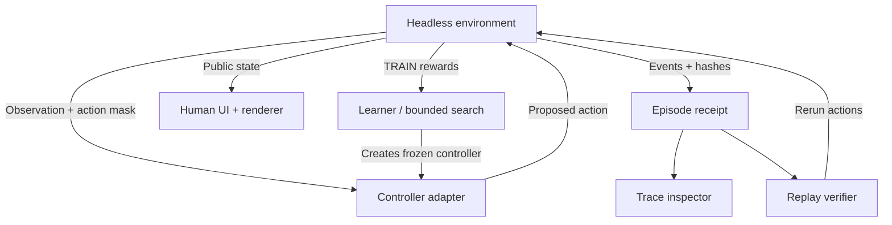

# Version 6 architecture

Brain Sweat remains a human educational studio. The 37 ordinary worlds, classes,
assistant/council, checkpoints, progress, retro lab, sound and offline shell are
preserved. Advanced instrumentation lives in the Agent Academy.

## Ownership

| Layer | Responsibility |
|---|---|
| `src/runtime/arenaRules.ts`, `roverRules.ts` | Canonical deterministic physics/resources/objectives; V5 default behavior retained |
| `environment.ts`, `types.ts` | Private authoritative state; versioned config, reset/observe/mask/step/snapshot/restore/hash/result |
| `controllers.ts` | Human, authored, rule, replay and frozen-Q decisions; observations only |
| `receipts.ts` | Bounded full receipts, environment replay verification, immutable tick inspection, fast headless runs |
| `packages.ts`, `experiments.ts`, `curriculum.ts` | Strict data-only packages, reproducible training/evaluation manifests and transfer definitions |
| `multiAgent.ts` | Shared ordered-turn dispatch transition, per-agent observations/actions and local team substrate |
| `src/training/models.ts` | Bounded neighborhood search, actual tabular Q updates, legacy Academy validation |
| `src/app/RuntimeLab.tsx` | Approachable experiment controls, split/transfer reports, inspection, local file exchange |
| `legacy.ts` | Existing arena React checkpoints and visual traces adapted to the authority boundary |
| `src/online/server.ts` | Server-selected seeds, independent policy execution and CAS-authorized online state |
| Renderer/audio | Read state; presentation timing/randomness cannot change a simulation |

Only sports, outpost, scenario, space and the Academy rover migrate in this rung.
The remaining worlds keep their verified game loops. Mission checkpoints retain
their shapes; arena transitions now pass through a validated human/policy
adapter. Search uses the headless runner directly. The Q learner updates its own
table from environment transitions, while evaluation uses frozen greedy values.
No controller receives `step`, `restore`, a mutable state reference, or a server
credential. Host code owns those operations.

## Data and performance

Profile schema stays at version 2. Missing Academy data migrates to a fresh
Academy; existing V5 `controllers`/`rover` data gains an empty experiment
notebook. Version 1 policy files remain supported in the lab, arenas and online
policy editor. New artifacts have independent schema/runtime/environment
versions. See [runtime contracts](agent-runtime.md).

The notebook retains three manifests, one verified receipt and one controller
package per local profile. It is limited to 600 KB; separate Academy imports
are limited to 900 KB and full progress imports retain their existing 2 MB
limit. Rule and rover histories stay at 80 points, arena traces at 120 ticks,
rover traces at 80. No unlimited episode history or cloud archive is added.

Initial profiling found repeated route/observation construction made the full
12-curriculum search regression take about 72 seconds locally. Headless
assessment now avoids legacy visual traces, observations are immutable and
cached until the next step, and deterministic route answers have a bounded
4,096-entry cache. The same regression takes about 8–10 seconds locally; its
individual test budget is 20 seconds, with every original assertion retained.
A 1,000-episode sweep executes roughly 77,000 duplicate-checked transitions in
about 1.5–1.6 seconds on this workspace, including a 1,000-episode learner setup
and 15 verified receipts. These are machine-specific measurements, not an SLA.

React training yields between bounded batches/generations/trials. Pause and
hidden-tab state cancel pending work; switching tools/unmounting drops the
experiment iterator. Refresh/import starts stopped. Trace inspection reads
immutable recorded transitions and does not advance an environment. WebGL2
retains its frame/resolution caps, resource disposal and vector fallback.

## Catalogue and release

Current UI counts derive from actual manifests. `MISSIONS_PER_WORLD` and the
difficulty array define completion slots. A build-only TypeScript AST reader
counts literal catalogues without running React/profile modules, generates HTML
and OpenGraph metadata, and emits cached `studio-manifest.json`. Unsupported
catalogue expressions fail the build. Historical verification/screenshots keep
their original counts/version labels.

The frozen V5 commit and extraction evidence are in [the audit](v6-audit.md).
PR workflows exercise production prefix/offline/upgrade/database/browser checks
without deploying Pages. The operator merged V6 on 2026-10-03; Pages publication
and actual published-site verification passed. Future publication still
requires operator approval. Public online remains pending.
