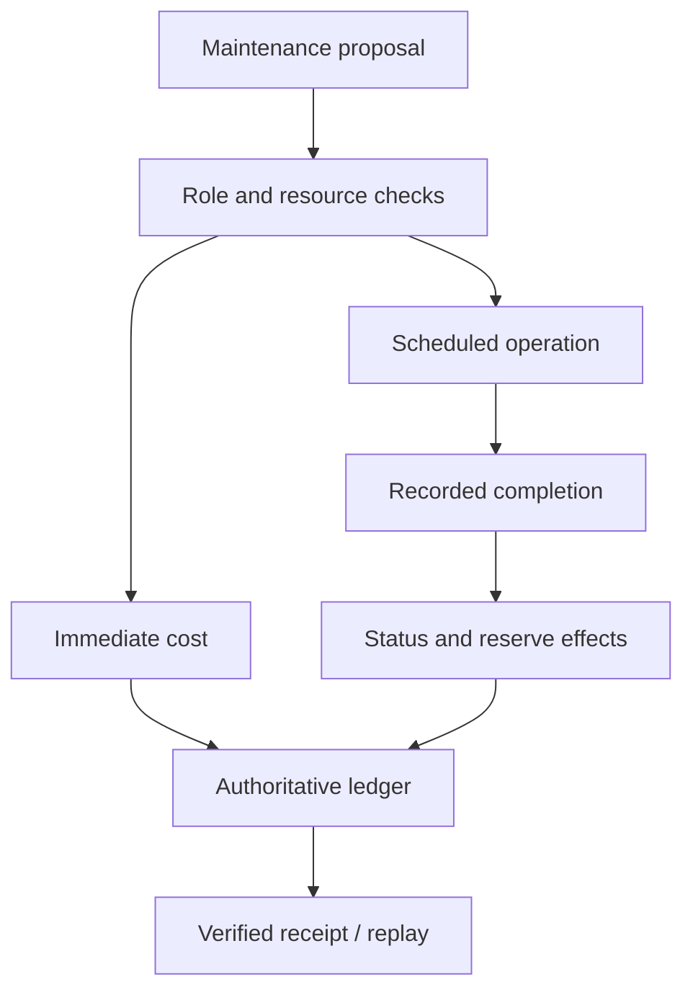

# Authoritative causal ledger

The ledger contains actual action, resource, entity, flag, move, reveal,
schedule, trigger, cancel, complete, objective, signal, notice and failure
entries. Each has an id, simulated tick, processor/action source, cause id,
target and before/after value. A delayed operation's completion points to its
scheduling action; its effects point to that completion. Event recurrence
points to the prior actual trigger/cancellation. Rules identify their declared
processor ids. No language model supplies the official causal explanation.

The operations board shows operator state; the role panel shows only that
actor's masked observation. The timeline has a scrubber, event/objective/failure/checkpoint/
handoff jumps, ledger filtering and a per-frame team proposal/validation view.
Backward inspection reads a separate verified replay environment and does not
mutate the original campaign. Declared plans and their edits appear beside
actual execution, with no claim to know a controller's internal reasoning.

Recorded links describe this simulator's explicit transitions. Rule source ids
and predicates remain inspectable in the embedded spec. They are not a proof
of real-world causation, philosophical causality, model identity or credentials.
Unsigned provider notes and public memory remain distinct from world events.
