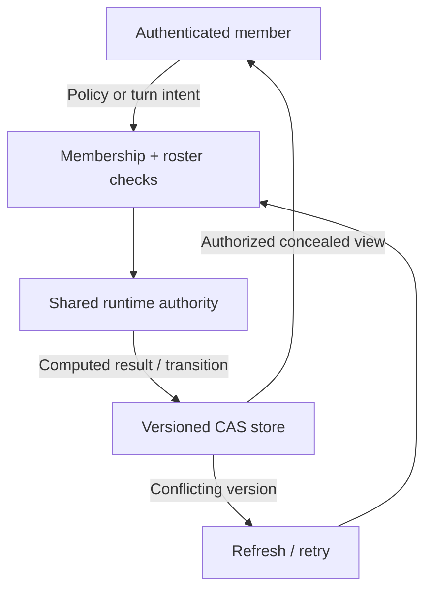

# Private online service

The offline studio is fully independent of this service. The online client and server are implemented and tested, but the published configuration currently has no endpoint. The public commons explains that setup is pending when a player chooses Connect online.

## Deploy to a dedicated project

Create a separate Brain Sweat Studio Supabase project in the account owner's chosen organization, after confirming the quoted project cost. Do not reuse an unrelated application's production project.

The CLI-generated migration is in `supabase/migrations/20261003095650_brain_sweat_online.sql`. Apply it to the new project. It creates one bounded JSON storage table with expiration and membership indexes, enables RLS, revokes public/anon/authenticated table access, and explicitly grants the service role its required operations. No browser can query or edit this table directly.

Package the shared code before every Edge deployment:

```sh
node scripts/package-online.mjs
deno check supabase/functions/brain-sweat-online/index.ts
```

The packager copies the canonical, tested handler, store adapter and types beside the Edge entrypoint, plus the shared `runtime/` modules for rules, observations/actions, controllers, receipts and ordered dispatch. Deploy the complete generated directory, including `index.ts` and `deno.json`, as `brain-sweat-online`. The dependency-free runtime is React-free and Deno-checkable; generated copies are ignored by git and must never be edited independently. The function's `verify_jwt=false` setting is intentional: every POST is authenticated by the handler's random 256-bit device credential. It also enforces membership, host permissions, capacities, request bounds, rate limits, and atomic version checks. Platform JWT authentication would reject this custom credential.

The entrypoint reads Supabase's built-in server-side URL and secret-key environment variables, with legacy service-role support. Never add a secret or service-role key to the website, repository, client configuration, logs, or player exports. Only the public publishable key belongs in the client configuration.

Once remote checks pass, update `public/online-service.json`:

```json
{
  "endpoint": "https://PROJECT_REF.supabase.co/functions/v1/brain-sweat-online",
  "publishableKey": "PUBLIC_PUBLISHABLE_KEY"
}
```

Commit that public configuration and let the normal Pages workflow deploy it. Service configuration is fetched only after Connect online, with caching disabled. The offline service worker excludes it. The Edge CORS allowlist is currently the studio's GitHub Pages origin; a fork must update that origin.

## Verify before enabling the public endpoint

- Confirm the table is RLS-protected, browser roles lack grants, and the service role can perform only the required table operations.
- Check the deployed function's authentication, private invitations, outsider denial, host-only start, stale-update conflict, and deletion behavior with separate device credentials.
- Use two independent browser sessions to join one room, rotate cooperative turns, transfer clan ownership, and submit different controllers to the same three-round tournament.
- Confirm server-calculated results, concealed opponent results before all submissions, reconnect persistence, and unchanged local XP.
- Confirm the public config contains only a publishable key; inspect Supabase security advisors and function logs without printing credentials.

The test server's `/__online-test` endpoint exists only when `ONLINE_TEST_SERVER=1` is set. It runs the same handler and canonical models against a memory storage adapter for browser tests. It is not a deployed service or a substitute for the remote checks above. CI separately applies the real migration to an isolated PostgreSQL container and verifies permissions, membership queries, and simultaneous updates.

## Player behavior

| Feature | Behavior |
| --- | --- |
| Community Dispatch | Private room, 2–4 players, three tasks, shared ordered turns |
| Agent Duel | Private room, 2–4 players, three shared seeded evaluations |
| Clan | Private preset name, up to 20 members, host transfer and team signals |
| Agent League | Private tournament, 2–16 players, optional clan association, three-round standings |
| Controller | 1–8 bounded priority rules; server evaluates it for at most 120 ticks per round |
| Scoring | Highest model score, then fewer ticks per round; sole winner 3 points, tied winners 1 each |
| Invitations | Random 12-character code; no public discovery directory |
| Identity | Generated name and hashed device credential; no email or real-name sign-up |
| Privacy | No free-text chat, direct messages, offline save uploads, advertising, or analytics |
| Lifetime | Rooms/events one day; clans 30 days; device identities 90 days |
| Deletion | Removes the credential and memberships, submissions, signals, and associated action-log entries |

Expiry makes records inaccessible immediately. Cleanup runs periodically during requests. Disconnect keeps the credential for reconnecting; clearing browser storage loses it. Leaving an active event closes that event, preserving a fixed competition roster. Online play never changes local game XP, badges, or class mastery.

## Version 6 authority and replay evidence

Agent Duel and League use `recordEpisode` with server-selected seeds and Builder difficulty. Each bounded round stores its environment version, receipt digest and final state hash beside score/ticks/completion. Full local Academy traces, learner tables and notebooks are not uploaded by this integration. Legacy stored rounds without hashes remain readable. The server does not accept client result/receipt fields. Cooperative dispatch uses the same pure ordered transition as the local multi-agent substrate, then commits only through the existing authenticated CAS handler.

The PR production workflow runs the isolated PostgreSQL grants/RLS/CAS suite and connected browser tests without Pages publication. No production secret, project, billing, or public endpoint is changed by Version 6. Supabase dependency/changelog guidance was checked before packaging; no new remote SDK or platform API is required.



## V7 model boundary

Local model receipts and Garage runs are not accepted as online results. The
server still chooses seeds and executes validated data-only rule controllers.
Model competitions are future work; no model/provider code or local bridge is
packaged into this Edge handler. The public endpoint remains pending setup.
