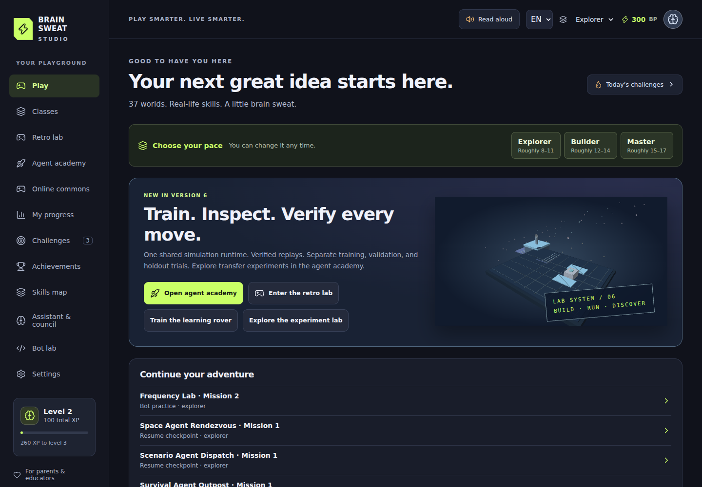

# Version 6 verification

**Release status: V6 published and publicly verified; repaired main-branch CI green.**
The operator merged PR #1 at `3c70e628263594dffd15feaafc87f711e328b523`
on 2026-10-03. Pages publication and the actual public V6 check passed in
[run 37153404037](https://github.com/larrinamsalva/brainsweatstudios/actions/runs/37153404037).
Public online configuration remains empty and described as pending. No tag,
production secret, billing or paid-service change is included.

## Acceptance scope

V6 keeps 37 worlds, 48 classes, 888 mission/difficulty slots and 80 badges. Five
agent simulation families now share an authoritative headless runtime. See
[baseline audit](v6-audit.md), [architecture](architecture.md),
[runtime contracts](agent-runtime.md), and [Academy guide](academy-guide.md).

The architectural release passed its complete integrated checks at
[`758539f3ee7a944223e3b961a3de78ab0a4e2ae2`](https://github.com/larrinamsalva/brainsweatstudios/commit/758539f3ee7a944223e3b961a3de78ab0a4e2ae2).
The post-merge test-only repair is
[`90a27bbb26048d85d45af6ba61caae71b1284873`](https://github.com/larrinamsalva/brainsweatstudios/commit/90a27bbb26048d85d45af6ba61caae71b1284873);
it waits for persisted notebook data and adds ten repeated WebKit checks.
Game/runtime code is unchanged. Its integrated rerun is recorded below.
Documentation-only main-branch changes do not repeat the CI simulation sweep
or publish Pages.

Local checks pass install, ESLint, TypeScript/production build, 162 unit tests
across 11 files, the headless harness and Deno 2.9.6 deployment-package check.
Browser executables are unavailable in this workspace, so real browser and
production evidence comes from GitHub Actions; no local launch failure is
counted as a passing browser check.

## Runtime evidence

- 48 golden arena outcomes were produced from immutable V5 source, covering all
  four arenas, all three difficulties and four seeds each. Headless authority
  matches them exactly. Existing 888 authored gameplay checks remain required.
- Frozen observations, detached snapshots, unavailable/invalid actions,
  terminal masks, strict restore and deterministic reset/step/hash are tested.
- Human, authored, rules, replay and frozen-Q adapters use the same boundary.
  Wind receipts preserve requested and executed actions separately.
- Replay verification checks every observation, mask, event, reward, changed
  field, step hash and terminal result. Alterations fail even with recomputed
  digests; incompatible versions and oversized histories fail. These unsigned
  receipts verify execution, not the identity of their claimed controller.
- Strict packages, legacy policies, manifests and old profile imports are
  checked. TRAIN/VALIDATION/HOLDOUT are disjoint across all 100 supported
  experiment seeds. Evaluation/transfer does not update learned values.
- All five families have meaningful transfer changes; manifests rerun from
  their initial controller and reproduce measured results and receipt hashes.
- Ordered multi-agent observations/masks/turns and shared state are checked.
  Existing online membership, concealed results, authority and simultaneous
  CAS tests stay in the suite; server hashes match canonical local runs.

The repaired main-branch production CI 1,000-episode harness observed 76,766
duplicate-checked steps, 978 goal completions and 15 verified receipts in 1,400
milliseconds (reported 54,840 steps/second). A local 10,000-episode sweep checked 770,088
steps, 9,754 goal completions and 15 verified receipts in approximately 9.8
seconds. Both reran identical seeds and checked unchanged evaluation tables.
The recipes include five families, three difficulties and standard/transfer
conditions. Throughput is machine-specific; success is a bounded simulation
outcome, not a capability ranking or performance guarantee. Histories,
receipts, notebooks and route caches have explicit finite bounds; UI training
yields and pauses when hidden.

## Integrated browser and production evidence

| Final check | Evidence | Result |
| --- | --- | --- |
| Production build, offline/update and isolated online acceptance | [Run 37149755755](https://github.com/larrinamsalva/brainsweatstudios/actions/runs/37149755755) | Passed |
| Lint, 162 unit tests, TypeScript and production packaging | Both final workflows at the tested code commit | Passed |
| Deno 2.9.6 check of packaged canonical online handler/runtime | Production workflow | Passed |
| PostgreSQL grants/RLS, denied browser access, membership and simultaneous CAS | Isolated PostgreSQL 17 service in production workflow | Passed; exactly one concurrent update wins |
| Stale-worker reproduction and v1→V6 update with two old tabs | Production workflow | Passed |
| All 37 offline worlds, 48 classes, Academy learning and new experiment/receipt restoration | Production workflow | Passed |
| Focused production browser suite at `/brainsweatstudios/` | Production workflow | 46 passed |
| Full authored gameplay and cross-browser accessibility | [Run 37149755794](https://github.com/larrinamsalva/brainsweatstudios/actions/runs/37149755794) | 1,050 passed, including all 888 authored mission/difficulty runs |
| Existing Academy in Chromium/Firefox/WebKit | Same browser workflow, separate focused step | 16 passed; two existing GPU/audio instrumentation skips |
| New runtime experiments in Chromium/Firefox/WebKit | Same browser workflow, separate focused step | 18 passed |
| Initial actual public V6 verification | [Run 37153404037](https://github.com/larrinamsalva/brainsweatstudios/actions/runs/37153404037) | Passed; V6 live, zero page errors |
| Post-merge test repair: three-browser runtime checks, repeated WebKit persistence and full gameplay | [Run 37154319225](https://github.com/larrinamsalva/brainsweatstudios/actions/runs/37154319225) | Passed: 1,050 main-suite cases including all 888 authored missions; 16 Academy, 18 runtime and ten repeated WebKit cases |
| Post-repair production/deployment/public verification | [Run 37154319178](https://github.com/larrinamsalva/brainsweatstudios/actions/runs/37154319178) | Passed: 162 unit tests, 46 production browser cases, offline/update/database checks and actual public V6 verification |

The pre-release browser workflow passed 1,084 distinct cases (1,050 main-suite, 16 Academy
and 18 runtime). The two pre-existing Firefox/WebKit skips are the Chromium-only
real shadow/audio resource-instrumentation check; that check passed in Chromium.
Vector fallback, reduced motion and accessibility run in all three browsers.
Three additional connected WebKit phone cases passed in a separate focused
step and repeat cases in the main suite; they are not added to the distinct
total. There were no failed or flaky cases in those pre-release logs.

The browser workflow separately checks the existing Academy and the new runtime
experiments in Chromium, Firefox and WebKit, then runs the complete original
gameplay/interface suite. Coverage includes WCAG AA, keyboard and touch,
English/Spanish, 320/390-pixel layouts, reduced motion, vector fallback,
pause/refresh/import, frozen evaluation, tampered-data rejection, repeated
experiments and requests remaining local. Connected tests use the real handler
in an isolated test service; they do not activate a public online backend.

Initial integration found a recent-manifest button contrast issue, repaired
before this final production run. The unchanged V5 baseline and initial V6
runs also exposed a 5-second fallback training assertion finishing around
925–950/1000 episodes under concurrent CI. The focused training deadline is now
explicitly 20 seconds, retaining the 1,000-episode and minimum-delivery
assertions. No gameplay or accessibility assertion was removed.

After the operator's merge, `scripts/verify-live.mjs` passed against the actual
public V6 release. It checks current counts/version, player rewards, bot
isolation, classes, Academy learning, runtime experiments and verified
receipts, refresh, Spanish, council/retro lab and page errors. PR jobs exercise
the production build without deploying; main-branch jobs deploy and check the
published site.

## Post-merge WebKit persistence race

[Browser run 37153404044](https://github.com/larrinamsalva/brainsweatstudios/actions/runs/37153404044)
failed one of 18 runtime cases in WebKit: the test dereferenced
`experiments[0].traceHashes` after seeing the result heading, while the saved
notebook was still empty. Academy writes local storage in a React passive
effect after rendering. The failure's page snapshot already showed the result
and Recent experiments entry. The merge, publication and live verification
succeeded; the full gameplay step of that failed browser run was not reached.

The repair polls for the actual saved notebook before inspecting its manifest,
with the existing bounded assertion deadline. Receipt checks also wait for
the saved environment, and imported manifests are compared with their saved
copy. All original 32-hash, split, pause, rerun, reload and malformed-import
assertions remain. A separate CI step repeats the paused save/verify/restore
scenario ten times in WebKit with three workers. It does not add test retries,
unconditional sleeps, skips or application behavior changes.

The repaired main-branch workflow passed all 1,084 distinct browser cases plus
ten repeated WebKit persistence runs. Its three additional focused connected
WebKit cases also passed. The two existing Firefox/WebKit GPU/audio
instrumentation skips remain; there were no failed or flaky cases. The full
1,050-case main suite took 23.1 minutes on this runner. Production's 46 browser
cases, database/upgrade/offline checks, deployment and actual public V6
verification all passed at the repair commit. The final evidence commit only
updates docs and adds the actual public screenshot; it changes no tested code.

## Captured review build

All nine images below come from the successful final production workflow's
`rung-six-studio-review` artifact (11282439792). They show the actual V6
production build, not a mockup or a public V6 deployment. Desktop, phone and
Spanish inspector images were visually inspected after capture.

[Controller search](screenshots/v6/controllers.png) · [Learning rover](screenshots/v6/rover.png) · [Sports arena](screenshots/v6/sports.png) · [Retro space lab](screenshots/v6/space.png) · [Agent class](screenshots/v6/agent-class.png) · [Phone experiment controls](screenshots/v6/mobile-experiment.png) · [Spanish trace inspector](screenshots/v6/spanish-inspector.png)

The additional public capture below comes from the successful post-repair
deployment's `live-studio-screenshot` artifact (11284849522), captured by
`scripts/verify-live.mjs` on the actual GitHub Pages site. Its anonymous local
progress was created by the verification session.

