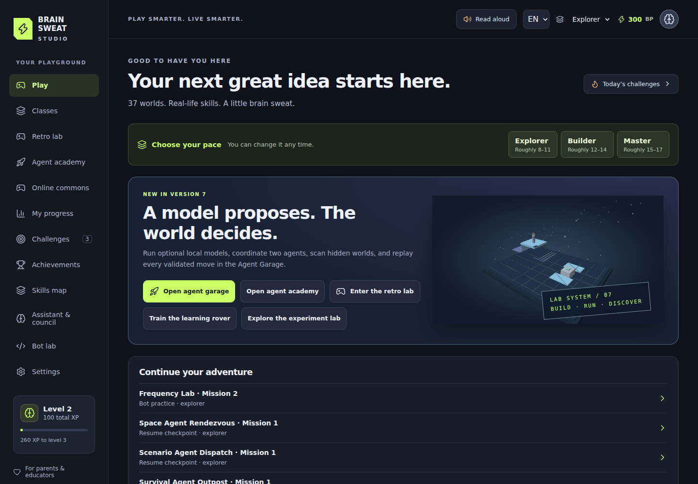

# Published Version 7 verification

V7 is published on [GitHub Pages](https://larrinamsalva.github.io/brainsweatstudios/)
after the reviewed merge of [PR #2](https://github.com/larrinamsalva/brainsweatstudios/pull/2).
[Open the Agent Garage](https://larrinamsalva.github.io/brainsweatstudios/#/academy?tab=garage).
The actual public studio passed verification on **2026-10-04 at 00:24:41 UTC**.

The checked PR head is `de5e417746a672d38ba7a3b94f047bb0d2a02155`.
Published merge `a50ac5e9f92b489db5e3d82096b44d0d37ba5185` has the identical
code tree, `a84f3a735095e0e5e2ac1d7b2cb56668b9f9e286`.
[Frozen V6 audit](v7-audit.md) records the starting baseline and its evidence.

| Check | Result |
|---|---|
| Locked install, lint, TypeScript and production build | Passed |
| Unit tests | 206 passed; 44 focused model/bridge cases |
| Original runtime sweep | 1,000 episodes, 76,766 transitions, 978 goals, 15 verified replays |
| Mock model-controller sweep | 32 completed missions, 786 ticks, 33 verified replays, eight frozen trials and reruns, six rejected-then-valid recoveries |
| Agent Garage in Chromium/Firefox/WebKit | 21 passed |
| Existing runtime features | 18 passed |
| WebKit paused-experiment persistence | 10 repeated cases passed |
| Existing Academy features | 16 passed, with two existing skips |
| Broader gameplay/accessibility/localization/online suite | 1,050 passed, including all 888 authored mission runs |
| Production advanced browser flows | 53 passed |
| Hard offline routes/classes/Garage, saving and service-worker upgrades | Passed |
| Deno online packaging, PostgreSQL permissions and simultaneous update isolation | Passed |
| Main release build, Pages deployment and actual public verification | Passed |

[Full PR browser workflow](https://github.com/larrinamsalva/brainsweatstudios/actions/runs/37162964669),
[PR production workflow](https://github.com/larrinamsalva/brainsweatstudios/actions/runs/37162964676),
and [published build/deploy/live workflow](https://github.com/larrinamsalva/brainsweatstudios/actions/runs/37164463823)
provide the immutable logs and captures. No meaningful existing coverage was
lowered and no new skips or unconditional retries were introduced.

The actual public check exercised the Garage's hidden Survey, validated mock
actions, recorded-action replay and profile restoration. It checked the
37-world and 48-class catalogues and started 22 advanced world routes. It also
verified controller optimization/evaluation; 1,000 learned-rover episodes and
evaluation; frozen experiments and refresh; personal assistant and
Mentor/Benefactor/Strategist council; retro engine; saved music/derivative work;
human rewards and bot isolation; Spanish refresh; and zero page errors.

The [seven permanent initial review captures](screenshots/v7) were taken from
production PR head `03feabcb188dc194a2c90274f582e8dcf04db82c` before follow-up fixes.
Fresh captures for the final checked head and published code are attached to
their production workflows as `rung-seven-studio-review`; the actual public
capture above comes from `live-studio-screenshot`.

The focused boundary tests cover detached observations, all eight worlds,
illegal/malformed/refusal/oversized/timeout output, bounded retries, cancellation
and stale replies, same-world handoffs, roles/masks/signals, scan costs,
contexts/notebooks, redigested replay tampering, frozen split/transfer reruns,
loopback origins/Host/bodies/floods/concurrency/deadlines/disconnect, malformed
discovery/provider envelopes, secret projection and safe profile migration.
Large frozen-table handoffs are rejected atomically before recordings overflow.
Valid larger legacy receipts still verify and restore within their existing
import bound; older local comparisons are pruned when needed to preserve them.

The first PR offline test disabled networking before the lazy Garage loaded and
counted same-origin static/worker GETs as provider calls. The corrected test
waits for controls and checks provider/external requests and network writes,
retaining offline execution/replay assertions. The independent production
offline/reload check and all final Garage cases passed.

The recorded local mock sweep took 1,464 ms: 36 ms in world steps, 136 ms awaiting
mock controllers and 502 ms verifying receipts. Its largest receipt was 208,619
bytes; four cooperative episodes used 36 ticks total. Displayed steps yield for
35 ms; existing render caps remain. Timings are machine-specific, not real-model
latency claims. The unchanged local V6 sweep took 1,166 ms. The shared profile
validation bundle is 543 KB minified (192 KB gzip); Vite retains its 500 KB
advisory. No build assertion or warning threshold was lowered.

`npm run qualify:ollama` reports **unavailable**, with zero discovered models or
trials in this workspace. Adapter/bridge/browser transport mocks are distinct
from actual model qualification. Recorded-world replay is distinct from model
regeneration. No real-model success, general intelligence or professional
qualification is claimed. Local models are optional; public online remains
configuration-pending and model competitions remain future work. No model
download, cloud account, paid service, production secret change or release tag.
