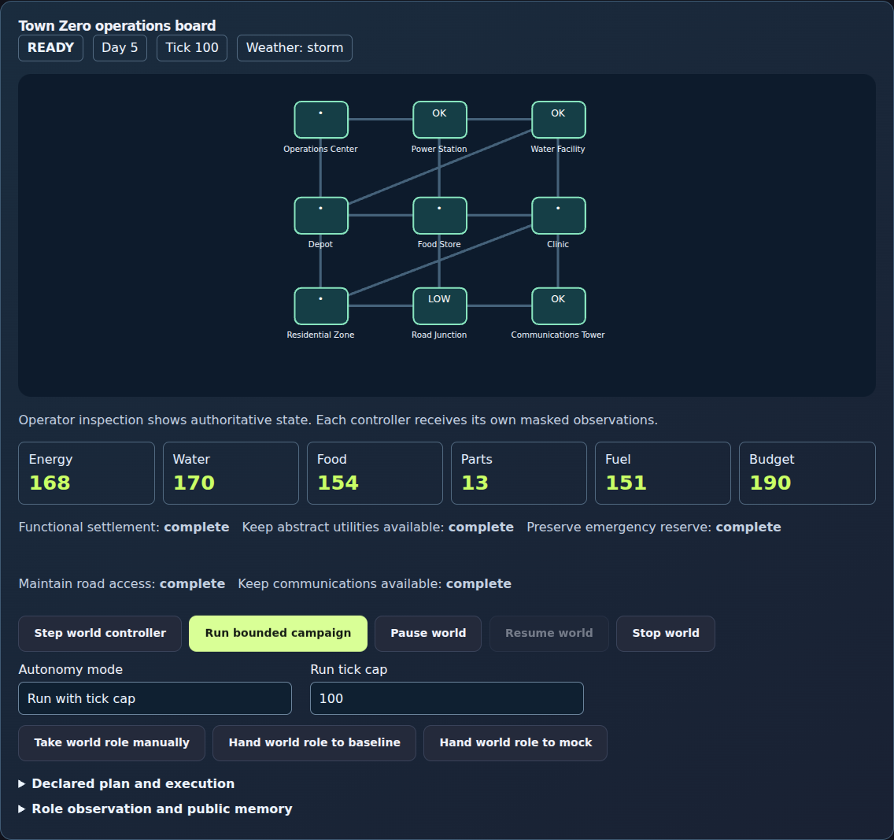
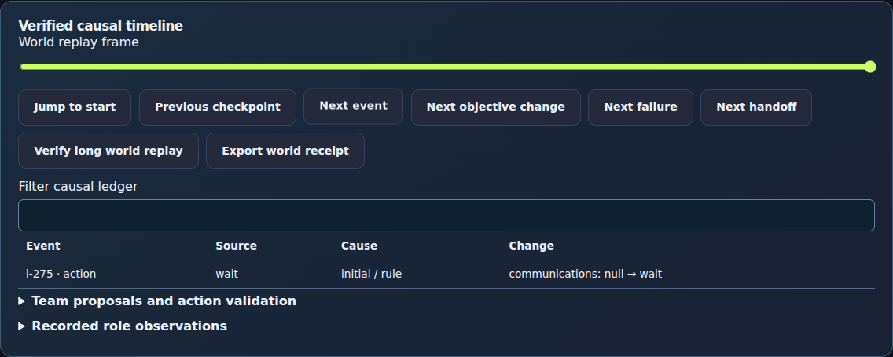
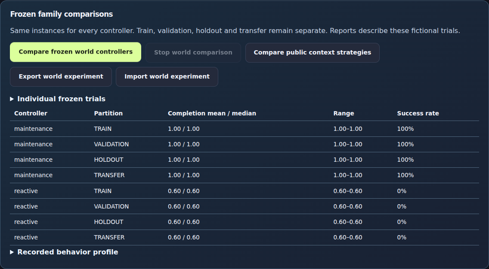
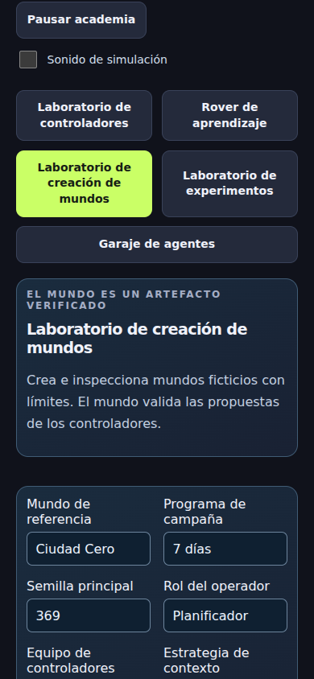

# V8 verification and release gate

V8 is built in [PR #3](https://github.com/larrinamsalva/brainsweatstudios/pull/3).
It has not been merged or published. The actual public studio remains V7.
A reviewed merge, Pages deployment and actual-live verification remain required
before calling V8 released. No release tag, model download, paid service,
production credential change or public online activation was made.

The immutable starting main is `343d6c0fdd334b79e5b62aadadb195af1d7a2ff3`;
published V7 code is `a50ac5e9f92b489db5e3d82096b44d0d37ba5185`.
[Audit and implementation plan](v8-audit.md) records the fresh baseline.
The 37 human worlds, 48 classes and 888 authored mission slots remain unchanged.
V6/V7 individual schemas and their original validators remain independent.

## Current evidence

Source `58060394a9ce96ae4cf2cbed285c7056a911fe3f` passes 257 unit cases
(the original 206 plus 51 V8 cases), lint, TypeScript and production build in CI.
Its production workflow passes all 59 advanced Chromium cases. Its gameplay
workflow passes all 18 World Lab cases in three browsers and ten additional
WebKit visibility/outage executions. The same gameplay workflow records the
complete authored-mission and accessibility regression; its immutable result is
linked below. Actual Pages/live V8 verification still requires a reviewed merge.

| Check | Recorded result |
|---|---|
| Locked install, lint, TypeScript and production build | Passed locally / in CI |
| Full unit suite | 257 passed locally and in CI; original assertions retained |
| Original headless runtime | 1,000 episodes; 76,766 steps; 978 successes; 15 verified replays |
| Existing deterministic mock sweep | 32 successes; 786 ticks; 33 verified replays; eight frozen trials; six recoveries |
| Town Zero headless | Full 7- and 30-day campaigns and 20-/100-world batches passed |
| New world validation/authority/receipts/family tests | Passed |
| Existing Academy/runtime/Garage browser cases | Passed in three browsers on the visibility-fix source |
| New World Lab browser cases | 18 passed in Chromium/Firefox/WebKit; ten repeated WebKit visibility/outage cases passed |
| Production upgrade/offline/online SQL checks | Passed on the visibility-fix source |
| Full 888-mission and broader accessibility suite | Complete prior V8 run: 1,050 passed, including all 888 authored missions; visibility-fix result in the linked gameplay workflow |
| Actual Pages V8 / live verification | Pending reviewed merge |
| Actual installed Ollama | UNAVAILABLE; no models or trials |

The current regression workflows exercise all existing suites without lowering
assertions/deadlines or adding unconditional retries. The new World Lab suite
checks 7-/30-day mock replay, human delayed actions/plans/memory/handoffs, atomic
imports, worker manifests and individual frozen receipt reproduction, Spanish,
keyboard/aXe/narrow layouts, hidden/pause lifecycle and production outage recovery.
Local browser execution was blocked by missing executables and an unsuccessful
browser download; browser evidence comes from the actual production CI build.

The visibility-fix source is `58060394a9ce96ae4cf2cbed285c7056a911fe3f`:
[production evidence](https://github.com/larrinamsalva/brainsweatstudios/actions/runs/37175585974)
and [gameplay evidence](https://github.com/larrinamsalva/brainsweatstudios/actions/runs/37175585963).
The complete prior V8 gameplay run passed all 1,050 cases on
`66783bf82044d0503a3caee177e451d888fe5dd9` in
[37172403751](https://github.com/larrinamsalva/brainsweatstudios/actions/runs/37172403751).
Evidence links identify the tested code independently of later documentation-only
commits. A running or failed check is never counted as a pass.

## Boundaries exercised

The 51 V8 cases cover strict schema/size/depth/finite values, malformed packs,
prototype keys/getters/unsafe processors, duplicate ids/references/cycles,
role scopes, detached masks/hidden buckets, paid inspection, delayed costs and
actual cancellation provenance, scheduler overflow and finite accounting,
simultaneous shared assets and completion-order independence, ignored aborts,
timeouts/request economy, rejected lifecycle/artifact updates, long hash-chain/
checkpoint replay, redigested tampering, stopped restore with receipt identity,
controller memory/plan persistence, generic provider-request@2, reproducible
100-instance families, split leakage, bounded mutations/distributions, isolated
frozen trial selection and three public context strategies, repeated rejection/
delayed-outage diagnostics, actual per-resource costs, canceled outage exclusion
and descriptor-safe save/report validation.

Offline context comparisons use the authored deterministic mock. They establish
the experiment mechanism; no actual-model memory/recovery result is claimed.
Unsigned receipts prove simulation replay, not who generated an action or a
provider's private reasoning. No IQ, general intelligence or certification claim.

## Measured local capacity

The [machine-readable result](v8-performance.json) comes from the shared headless
runtime. Measurements are machine-specific, descriptive and outside React/provider
latency. The 10,000-step sample resets 30-day campaigns; it is not one 10,000-hour
Town Zero scenario or an arbitrary-scale promise.

| Work | Time | Evidence size / count |
|---|---:|---:|
| 1,000 authoritative steps | 239 ms | Two campaigns |
| 10,000 authoritative steps | 1,954 ms | 14 campaigns |
| Full 7 days | 78 ms | 168 ticks; 201,824-byte receipt |
| Full 30 days | 279 ms | 720 ticks; 799,560-byte receipt |
| Offline mock 30 days | 514 ms | 720 ticks; 706 requests; 803,734-byte verified receipt |
| Full 30-day receipt verification | 326 ms | Every transition/checkpoint |
| Frozen 20-world batch | 3,222 ms | 20 verified trials |
| Sequential 100-episode batch | 15,277 ms | 100 verified trials |
| Generated family | 529 ms | 100 disjoint reproducible instances |

Standalone recordings are capped at 8 MB; local World Lab saves at 1.1 MB.
The new UI is lazy loaded (~46 KB minified) and the batch worker is ~69 KB.
The shared profile bundle remains ~550 KB minified / 188 KB gzip, with Vite's
original 500 KB advisory retained. Production precaches the worker and 41 static
assets. No warning or build threshold was relaxed.

## Findings corrected during verification

Initial V8 CI saturated the small runner with concurrent deterministic searches.
Unit file concurrency is now bounded at two, preserving original test deadlines.
Short runtime trials share a bounded 12 ms slice to avoid repeatedly rendering
the trace inspector between each trial; existing Firefox/WebKit regressions pass.
The long mock UI also reuses its immutable already-verified display receipt;
STATE_ONLY/notebook requests omit unused history, and RECENT_WINDOW walks back
only until six own actions are found. This removes redundant replay/history work
while retaining full verification of saved and explicitly replayed receipts.
New aXe checks found keyboard-inaccessible overflow tables; scroll regions and
JSON views now receive keyboard focus. Restoring a completed frozen receipt now
preserves its original ending/hash until new evidence is added, while the session
itself starts STOPPED.

A WebKit hidden-tab regression exposed a pause acknowledgment/save race: the
board showed PAUSED before its last completed burst was persisted. Visibility
now aborts at the synchronous browser event boundary, stops the worker and
publishes the completed receipt at pause. Academy commits that receipt to local
storage in the layout phase: its former passive save effect could still lag
behind the PAUSED board after the session had stopped. The shared paused effect
also publishes completed evidence. The same existing stability assertions
remain, with immediate board/storage tick equality checks, ten passing additional
WebKit visibility/outage executions and no retries.

Playwright 1.63 WebKit rejects service-worker reload with its offline-emulation
flag, also reproduced [upstream](https://github.com/microsoft/playwright/issues/42775).
The production-outage test closes an isolated origin server and proves ordinary
network fetch fails, then requires a 200 service-worker response, stopped restore,
replay and worker comparison. Chromium/Firefox also set the offline flag. This
retains three-browser outage coverage without skipping or retrying the failure.

Initial production review captures were inspected from code commit
`210c029ba408b50490435aa5e3bcfecd910e7434` in
[this workflow](https://github.com/larrinamsalva/brainsweatstudios/actions/runs/37170902015).
Final checked captures are generated by the same production workflow. These are
real UI screenshots of fictional baselines, not generated mockups or model results.

These permanent review captures come from passing production workflow
[37175585974](https://github.com/larrinamsalva/brainsweatstudios/actions/runs/37175585974),
code `58060394a9ce96ae4cf2cbed285c7056a911fe3f`. Their displayed state is an
intermediate baseline run, not a claim that the campaign finished at that frame.

[Authoring overview](screenshots/v8/authoring.png) ·
[Narrow operations controls](screenshots/v8/mobile-operations.png)
